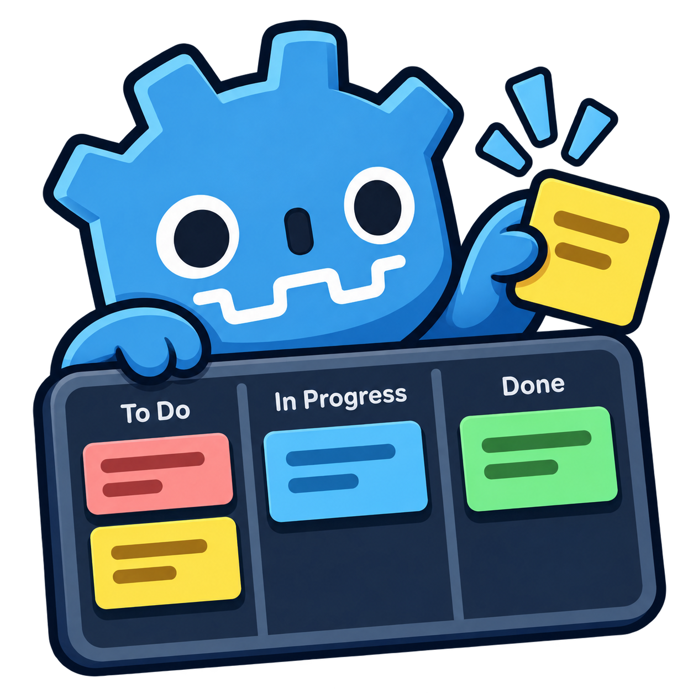
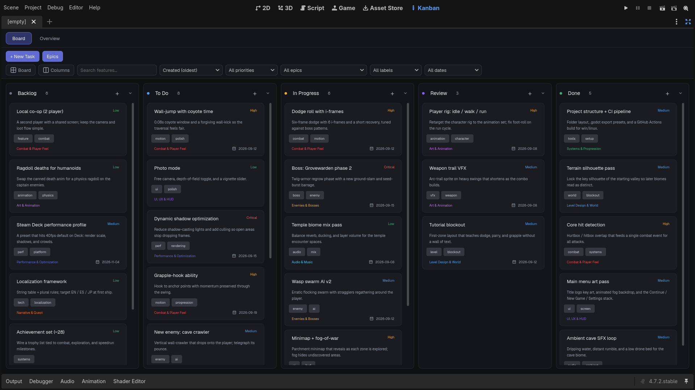
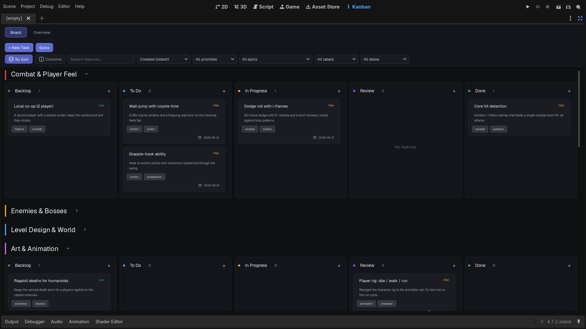
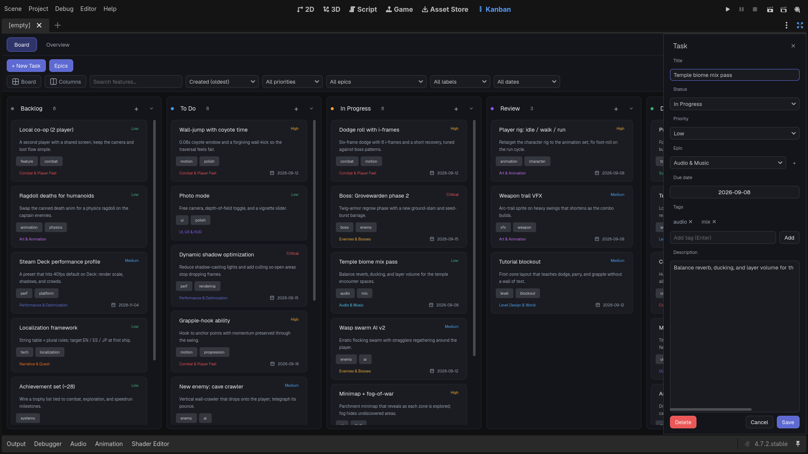
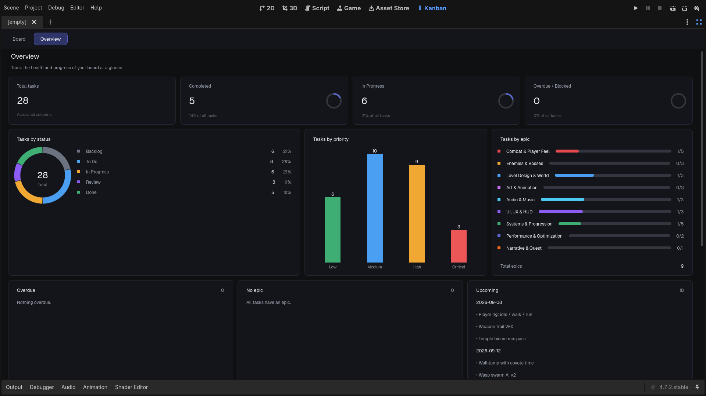

<p align="center">
  
</p>

<h1 align="center">Godoban</h1>
<h3 align="center">Advanced Task Manager for Godot</h3>

<p align="center">
  <strong>Plan, track, and ship your Godot project's tasks — right inside the editor.</strong>
</p>

<p align="center">
  
  
  
  
</p>

<p align="center">
  <a href="#-screenshots"><kbd>📸 Screenshots</kbd></a>
  &nbsp;&nbsp;
  <a href="#-features"><kbd>📖 Features</kbd></a>
  &nbsp;&nbsp;
  <a href="#-installation"><kbd>🛠️ Installation</kbd></a>
  &nbsp;&nbsp;
  <a href="#-data-persistence"><kbd>💾 Data</kbd></a>
  &nbsp;&nbsp;
  <a href="#-license"><kbd>📄 License</kbd></a>
</p>


---

## 📸 Screenshots

<div align="center">
<table>
  <tr>
    <td width="50%" align="center">
      
      <br><strong>The Board</strong>
      <br><sub>Five columns with drag-and-drop, priorities, epics, and due dates</sub>
    </td>
    <td width="50%" align="center">
      
      <br><strong>Per-Epic Mode</strong>
      <br><sub>One compact board per epic, toggleable from the toolbar</sub>
    </td>
  </tr>
  <tr>
    <td width="50%" align="center">
      
      <br><strong>Task Editor</strong>
      <br><sub>Create and edit tasks with tags, epics, priority, and a due-date picker</sub>
    </td>
    <td width="50%" align="center">
      
      <br><strong>Overview Dashboard</strong>
      <br><sub>Stats, a by-status donut, priority bars, and actionable lists</sub>
    </td>
  </tr>
</table>
</div>

---

## 📖 Features

### 🗂️ Board & Tasks

Take full control of the project's task list from a familiar, intuitive board.

<details open>
<summary><strong>See all Board features</strong></summary>

| Feature | Description |
|---|---|
| **Main Editor Tab** | Appears alongside 2D / 3D / Script as a first-class editor screen. |
| **Drag & Drop** | Drag cards between columns to change status, and reorder within a column. |
| **5 Status Columns** | Backlog, To Do, In Progress, Review, and Done — a fixed canonical set. |
| **Priorities** | Low, Medium, High, and Critical, color-coded on every card. |
| **Tags / Labels** | Free-form tags with a searchable picker; filter by any label. |
| **Due Dates** | Set a due date via a hand-rolled calendar popup (Godot has no built-in one). |
| **Descriptions** | Multi-line notes on every task. |
| **Click to Edit** | Click any card to open it in the slide-in editor; columns have their own "+". |
| **Collapsible Columns** | Fold a column to a narrow pill to reclaim space; state survives rebuilds. |

</details>

### 📚 Epics

Group related tasks under lightweight, color-coded umbrellas.

<details>
<summary><strong>See all Epic features</strong></summary>

| Feature | Description |
|---|---|
| **Title + Accent Color** | Each epic is just a name and a color — intentionally lightweight. |
| **Relational IDs** | Tasks reference an epic by id; changing it is one field, no nesting. |
| **Per-Epic View** | Toggle from one big board to a compact board per epic (plus a "No Epic" board). |
| **Epic Chips** | Cards show a colored chip naming their epic in the all-tasks view. |
| **Progress Bars** | The Overview shows each epic's completion (`done/total`). |
| **Safe Deletion** | Deleting an epic unassigns its tasks instead of orphaning them. |

</details>

### 🔍 Search & Filters

Find exactly what you're looking for, fast.

<details>
<summary><strong>See all Filter features</strong></summary>

| Feature | Description |
|---|---|
| **Live Search** | Case-insensitive match against title, description, and tags. |
| **6 Sort Modes** | Created (oldest/newest), latest edited, priority, due date, alphabetical. |
| **Filter by Priority** | Narrow to Low / Medium / High / Critical. |
| **Filter by Epic** | Isolate a single epic. |
| **Filter by Label** | Pick any tag; the picker even has its own search box. |
| **Date Bounds** | Overdue, due today, due this week (calendar Monday–Sunday), or no due date. |
| **Composed Filters** | All filters combine (AND); empty results show a friendly hint. |

</details>

### 📊 Overview Dashboard

A full-page analytics tab that rebuilds live with every change.

<details>
<summary><strong>See all Overview features</strong></summary>

| Feature | Description |
|---|---|
| **Summary Cards** | Total, Completed, In Progress, and Overdue/Blocked with ring progress. |
| **By-Status Donut** | A donut chart with a per-status legend and percentages. |
| **Priority Bars** | Vertical bars comparing task counts across priorities. |
| **Epic Shares** | One mini progress bar per epic, `done/total`. |
| **Actionable Lists** | Overdue tasks, tasks with no epic, and upcoming due dates grouped by day. |
| **Rebuilds Live** | Counts and charts update immediately as you change the board. |

</details>

### 🔄 View Modes

The same data, presented the way you want it.

<details>
<summary><strong>See all View features</strong></summary>

| Feature | Description |
|---|---|
| **All Tasks** | One board with all tasks across the five columns. |
| **Per Epic** | A compact board per epic, one header each. |
| **Vertical / Horizontal** | Stack cards down each column (classic), or flow them across a row per status. |
| **Layout Toggles** | Both view modes and the orientation are pure transforms — no data changes. |
| **Equal Columns** | Columns stay equal-width no matter how much each holds; collapsed ones stay narrow. |

</details>

---

## 🛠️ Installation

Godoban is a self-contained editor plugin. You can drop it straight into any Godot project.

1. Copy the `addons/godoban/` folder into your project's `addons/` directory.
2. In Godot, open **Project → Project Settings → Plugins**.
3. Enable **Godoban**.

> [!TIP]
> A **Godoban** tab appears next to 2D / 3D / Script. Open it and click **"＋ New Task"** to populate your
> first board.

---

## 💾 Data & Persistence

- Tasks are stored in a **pretty-printed JSON file** at `res://godoban_data.json` in your project root.
- It's **created on first run** and saved on every change (debounced ~0.5s), plus on editor save and exit.
- The JSON is **git-diffable** and easy to hand-edit or move between machines.

---

## 🧰 Tech Stack

| Layer | Technology |
|---|---|
| **Engine** | [Godot 4.7](https://godotengine.org) |
| **Language** | GDScript (`@tool`, runs in the editor) |
| **Persistence** | Pretty-printed JSON via `FileAccess` + `JSON` |
| **UI** | Native `Control` nodes, no scene files — the whole board is built in code |
| **Design System** | Central theme (`theme.gd`) + rasterized SVG glyphs (`icons.gd`) |

---

## 📁 Project Structure

<details>
<summary><strong>Click to expand the full directory tree</strong></summary>

```
addons/godoban/
├── plugin.cfg                     # Plugin manifest (name, version, entry script)
├── godoban_plugin.gd               # @tool EditorPlugin — wires the main-screen tab
├── godoban_main_screen.gd/.tscn    # Root Control; builds the toolbar + tabs + overlays
├── data/
│   ├── godoban_model.gd            # Pure Board / Task / Epic classes + (de)serialization
│   └── godoban_store.gd            # Persistence layer; the single source of truth
├── ui/
│   ├── board.gd                   # The board; "all" vs "epic", vertical/horizontal
│   ├── column.gd                  # One status column; drop target with insertion index
│   ├── card.gd                    # One task card; drag source, click-to-edit
│   ├── task_editor.gd             # Slide-in create/edit sidebar
│   ├── calendar_popup.gd          # Hand-rolled month-grid date picker
│   ├── epic_dialog.gd             # Manage epics (title + color)
│   ├── filters_bar.gd             # Search + sort + priority/epic/label/date filters
│   ├── overview.gd                # Full-page analytics dashboard
│   ├── overview_widgets.gd        # Self-drawn ring/donut/bar widgets
│   ├── theme.gd                   # Design tokens + StyleBox helpers (T.*)
│   └── icons.gd                   # Every glyph as rasterized SVG (I.*)
├── fonts/                         # Bundled Geist font (SIL OFL)
└── README.md
```

</details>

---

## 🤖 AI Disclosure

The development of this project was greatly assisted by AI.

---

## 📄 License

This project is licensed under the **MIT License**. See the [LICENSE](LICENSE) file for details.

The bundled `Geist` font is licensed under the **SIL Open Font License**; see `addons/godoban/fonts/OFL.txt`.

---

<p align="center">Made by <a href="https://github.com/jaelgonzalez">Jael Gonzalez</a></p>

<p align="center">
  <a href="#-screenshots">📸 Screenshots</a>
  &nbsp;·&nbsp;
  <a href="#-features">📖 Features</a>
  &nbsp;·&nbsp;
  <a href="LICENSE">📄 License</a>
</p>
